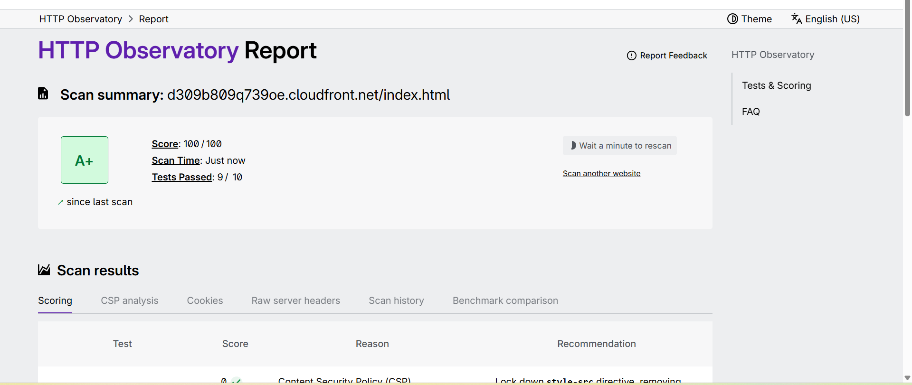

# AWS-secure-static-website-hosting
Hosting a static website on s3 is standard , but securing it for the current scenario is the real challenge 
# Secure Global Content Delivery System on AWS

##  Project Overview
This project demonstrates a secure, high-availability static website architecture hosted on AWS. Unlike standard S3 hosting, this solution implements a **Zero-Trust** security model using CloudFront Origin Access Control (OAC) and AWS WAF.

## 🏗 Architecture

## Hosted a static website on s3
1. uploaded required files on s3 as index.html,error.html,block.html. Also the content of the static website uploaded on the s3.
2. A seperate s3 configured for the cloudfront logs , related to the website which can be used to analyse certain cases , like ddos attack etc.

## 🔐 Security Features Implemented
1.  **AWS WAF (Web Application Firewall):**
    * Configured Geo-Match rules to block high-risk traffic (Traffic only from ITALIA is accepted and checked).
    * Implemented Rate Limiting (DDoS protection) to block IPs exceeding request thresholds.
2.  **CloudFront OAC (Origin Access Control):**
    * S3 bucket access is strictly limited to the CloudFront distribution. Direct public access is blocked.
3.  **HTTP Security Headers (A+ Grade):**
    * **Strict-Transport-Security (HSTS):** Enforced HTTPS.
    * **Content-Security-Policy (CSP):** Mitigated XSS attacks by restricting asset sources.
    * **X-Frame-Options:** Prevented Clickjacking.

## 🏆 Security Benchmark
Achieved an **A+ Rating** on SecurityHeaders.com.

## 🛠 Tech Stack
* **AWS Services:** S3, CloudFront, WAF, Route 53, Certificate Manager (ACM).
* **Protocols:** TLS 1.3, HTTPS.